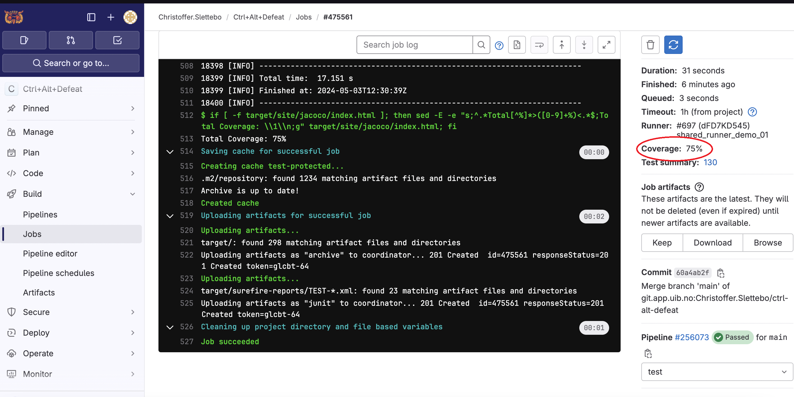

# Innlevering 4
- Teamnavn: Ctrl+Alt+Defeat
- Spillnavn: Mega Marius

## Medlemer og Roller:
* Hoved: Teamlead, Sekunder: Tester - Christoffer A. Slettebø
* Hoved: Nestleder, Sekunder: Utvikler - Olav Høysæther Opheim
* Hoved: Design Ansvarlig, Sekunder: Utvikler, Kundekontakt - Marius Soma
* Hoved: Test Ansvarlig, Sekunder: Utvikler - Henrik Johansen

## Enderinger ved Roller
- Vi la til Rollen: "Design Ansvarlig", Marius tok ansvar for mye av design prosessen av karakter, map osv. så derfor passer rollen bra.

## Rolle beskrivelse
- Teamlead: Ansvar for å planlegge tidspunkt for møter og sørge for at alle i teamet får samme melding og er informert.
- Nestleder: Ansvar for å skrive møte refferat for hver uke, og sørge for at trello er/blir oppdatert.
- Design Ansvarlig: Ansvar for design av maps, karakter og sprites. Samt fordele arbeidsoppagaver til utviklere ved behov om hjelp,
- Test Ansvarlig: Ansvar for at vi får laget tester, og tester vikitge funksjoner i spillet. Samt fordele arbeidsoppgaver til tester og evt utviklere ved behov.
- Utvikler: Jobber med programmering av spillet. Selvom vi har roller så flyter vi litt mellom oppgaver,så en utvikler vil jobbe med mye forskjellig.
- Tester: Jobber med testing av spillet, og kordinerer med test ansvarlig.
- Kundekontakt: Holde kontakt med kunder eller henvendelser.

## Hvordan fungerer rollene?
- Olav "jobber" forsatt som nestleder, dette fungerer fint siden struktur på referat og obliger blir lik.
- Christoffer "jobber" som teamlead, dette har fungert fint ved at han har planlagt møte tid, satt mål for videre jobbing. Han jobbet en del med test biten av prosjktet sammen med Henrik.
- Vi la til rollen "Design ansvarlig" og tilga den til Marius som har jobbet med å lage maps, design av karakter og sprites. Ellers lite kundekontakt.
-Vi syntes at rollene har fungert fint og at dette har vært en god erfaring å ta med seg. Vi har holdt oss noe lunde til rollene, selvom vi alle har jobbet litt på tvers av "rollene" vi har hatt.

## Erfaringer, gruppedynamikk og kommunikasjon
- Vi syntes at valget vi har tatt har fungert fint, det er nokk alltid ting som kunne blitt gjort anderledes. 
- Det er ingen spesielle valg vi ser på som dårlige og vi tar stort sett alle de større valgene sammen som et team. Dynamikken i gruppen er vedlig god. 
- Vi kommuniserer bra via discord ukentlig og ofte daglig når frister nærmer seg. 
- Vi sitte ofte alle sammen i discord ilag og jobber som par, eller som en hel gruppe å ser på problemet sammen. 
- Vi syntes at dette har fungert veldig bra. 
- Vi har ingen uenigheter som må løses.

## Commits til kodebasen
- Vi hadde en liten periode vi commitet med både norsk og engelsk commit melding, men vi bestemete oss for engelsk og har holdt oss til det en stund nå.
- Vi så ikke tilbakelemdilgene fra tidligere obliger før dagen før fristen så vi fikk ikke med oss at de ville at vi skulle skrive hvem som har jobbet sammen i par programmering i git commitsene. 
- Olav og Marius har jobbet en del sammen i prosjektet når det kommer til alt det grafiske, samt. 
- Henrik og Christoffer har jobbet en del sammen med testing. 
- Dette er de som har jobbet med sammen totalt, men alle har jobbet med alle gjennom prosjeket på ulike deler. 
- Vi sitter som regel alle fire i discord sammen og jobber. 
- Antall commits skal være ganske likt på de fleset ingen uregelmessiger som vi kan se, alle har bidratt like mye på prosjektet.

## Rapporter for denne "Sprinten"
- <a href="https://git.app.uib.no/Christoffer.Slettebo/ctrl-alt-defeat/-/blob/main/doc/rapport/uke16.md" target="_blank">uke16.md</a>
- <a href="https://git.app.uib.no/Christoffer.Slettebo/ctrl-alt-defeat/-/blob/main/doc/rapport/uke17.md" target="_blank">uke17.md</a>
- <a href="https://git.app.uib.no/Christoffer.Slettebo/ctrl-alt-defeat/-/blob/main/doc/rapport/uke18.md" target="_blank">uke18.md</a>

## Konsept
- Spill figur:
  - Kan bevege seg: høyre, venstre og hoppe (oppover).
  - Plukke opp "pessi" som er en brus boks som gir en power-up.
  - Power-uppen gjør spill figuren større og gir den muligheten til å ødelegge blokker av typen "bricks".
  - Kan drepe fiender ved å treffe den i hode ved å hoppe oppå de.
- To dimmensjonel verden som er bygd opp av:
  - Blokker som "grass", "brick", "coin brick", "pessi brick" samt "rør" (ikke en "block") som og har kollision.
  - Disse blokkene former platformer som spill karakteren kan gå/stå på
  - Spill figuren har kollisjon med blokker, hvis figuren er blitt stor kan den ødelegge blokkene "bricks".
  - Spilleren kan bevege seg opp ved å hoppe.
- Fiender:
  - Fiender som kan bevege seg til venstre og til høyre (retning endres ved kollisjon).
  - Fiender kan dø ved å bli truffet i hode av spill figuren, men kan også drepe figuren hvis figuren blir truffet i siden av fienden (altså i siden av kroppen)
- Utfordigene/formålet i spillet er:
  - Bevege seg gjennom verden (mappet) uten å falle uten for mappet.
  - Samle coins som gir høyere score.
  - Å unngå fiender eller evt drepe dem (som gir mer score).
  - Nå frem til enden av mappet som er en flagstang som representere målet for den verdenen (mappet).
  - Forbedre tiden man bruker på å komme gjennom mappet på, man kan se tiden man får i "scoreboard" menyen for de ulike mapsene".
- Verden:
  - Bygget opp av blokker med fast satt størrelse (felter i et 2D-rutenett).
  - Verden har plattformer som man kan hoppe opp på, og evt ødelegge hvis spill figur er stor og blokken er av typen "brick".
  - Verden er større enn skjermen, og viewet beveger seg vertikalt som følger bevegelsen til spill figuren.

## Prosjektmetodikk
* Mål: 
  * Utvikle et spill kalt "Mega Marius" som følger et gitt konspet og oppnår en viss funksjonalitet i en hver utviklingsfase.
* Faser: Vi kan si at spillet har blitt delt opp i 3 faser, Prototype-versjon, early-access versjon og release-versjon.
* Metodikk, Kaban:
  * Vi har valgt å gå for kaban metodikken og gjennomførte den ved å bruke (trello) verktøyet til å lage "kaban tavle".
  * I trello hadde vi kolonnene:
    * ToDo - Oppgaver: Her la vi inn små oppgaver som vi måtte løse, f.eks: lage et klassediagram.
    * Planlegging: Her la vi inn møter, planer f.eks: Planlegge muntlig presentasjon.
    * Aktive Oppgaver: Her flyttet vi oppgaver fra ToDo listen til denne kolonnen når vi begynte på en oppgave, slik ungikk vi å evt jobbe med samme oppgave samtidig.
    * Bugs i spillet: Her oppdaterte og la vi inn bugs som vi fant i spillet.
    * Utbedret/ fjernet bugs: Her flytte (samt modifiserte teksten til kortet) over fra bugs i spillet til denne kolonnen hvis vi fikk utbedret eller fjernet buggen som var i spillet.
    * Ferdig: Her flyttet vi over alle aktive oppagver som var blitt gjort ferdig til denne kolonnen.
* Utvikling og arbeidsflyt:
* Identifisere og håntdere ufoutsette hendelser:
  * Vi valget å ha en nestleder slik at hvis teamlead var borte, eller ikke hadde tid til møte så kunne nestleder steppe inn og ta ansvar for å planlegge møte med resten av gruppa som normalt.
  * Når det kommer til selve prosjektet og ufoutsette hendelser, vi valgte å møtes jevnlig og merge commite de vi hadde jobbet med slik at vi da kunne sammen gå gjennom de nye vi hadde lagt til å sjekke at alt funket så de skulle.
* Evaluering av prosjektmetodikk:
  * Vi syntes at bruk av kaban ved hjelp av Trello har funket fint.
  * Vi var litt dårlig i starten å bruke Trello som gjorde at vi av og til jobbet med samme filer og prøve å løse samme oppgaver, vi ser her at hvis vi hadde brukt Kaban mer aktivt i start så ville vi nokk sluppet at flere jobbet med samme filer. En god læring å ta med seg videre.
  * Vi ble bedre utover mot slutten av prosjektet å legge inn oppaver vi jobbet med, slik at vi ungikk å jobbe med samme filer.
  * Vi gikk og mer over til parprogrammering og satt mye i discord alle sammen og jobbet ilag. Dette syntes vi fungerte veldig fint, vi har alle kunnskap om forskjellige ting og de å jobbe sammen gjør at man får et ferskt blikk på oppgaver.

## Brukerhistorie
Her er en liste over et par brukerhistorer som vi har tatt utgangspunkt i når vi har jobbet gjennom prosjektet, samt når nye ting blir implementert:

Eksempel 1:
- Brukerhistorie: Som spiller ønsker jeg at spill figuren skal kunne hoppe.
- Akseptansekriterie: Spiller skal kunne trykke på en knapp(pil opp eller w) og da kan spill figuren hoppe.

Eksempel 2:
- Brukerhistorie: Som spiller ønsker jeg at spill figuren skal kunne bevege seg.
- Akseptansekriterie: Spiller skal kunne trykke på knapper (pil vensstre, pil høyre) og da vil spill figuren bevege seg til høyre eller venstre.

Eksempel 3:
- Brukerhistorie: Som spiller ønsker jeg at spillet skal ha en fiende som skal kunne skade spill figuren.
- Akseptansekriterie: Spiller skal kunne bli skadet av en fiende (edderkopp eller skilpadde) ved å kollisjon, da vil spill figuren kunne bli skadet og dø.

Eksempel 4:
- Brukerhistorie: Som spiller ønsker jeg at spillet skal ha musikk og lyd slik at man kan høre at man plukker opp eller interagerer med objekter i spillet.
- Akseptansekriterie: Spiller skal kunne høre musikk i spillet samt lyder når spiller interagerer med objekter.

Eksempel 5:
- Brukerhistorie: Som spiller ønsker jeg at spillet skal ha ulike menyer slik at jeg kan velge å: lese mer om spillet, lese hvordan man spiller, velge ulike maps, sjekke scoren min og en pause meny mens jeg spiller.
- Akseptansekriterie: Spiller vil kunne lese mer om hvordan man spiller (about meny, knapp i start meny), lese hvordan man spiller (help meny, knapp i start meny), velge maps (map select meny), sjekke scoren sin (scoreboard meny, scorebaord knapp i map select) og pause spillet (pause meny, ved å trykke "esc").

Eksempel 6:
- Brukerhistorie: Som spiller ønsker jeg at spillet skal å se tekst som viser hvilke knapper jeg skal trykke på for å restarte spillet hvis jeg dør.
- Akseptansekriterie: Spiller skal kunne se tekst som beskriver hvordan man restarter spiller hvis man dør.

## MVP:
* Vise et map.
* Vise spill figuren på mappet.
* Styre spill figuren slik at den kan gå til høyre, venstre og hoppe.
* Spill figur har kollisjon med blokker som vises på mappet.
* Vise en fiende; de skal ha kollisjon med både mappet og spill figuren.
* Spill figuren kan dø (ved kollisjon med fiender, eller ved å falle utenfor mappet)
* Målet med spillet er å komme til enden av mappet (som er vist med en flaggstang) uten å dø.
* Start skjerm ved oppstart og en game-over skjerm ved død og game-won skjerm ved å nå flaggstangen.

## Prototype-versjon
* Spill figur:
  * Lagd til sprites for figuren.
  * Lagd til bevegelse, kollisjon etc.
* Fiender:
  * Edderkopp (Ny), 
* Maps:
  * Level 1 (Ny), Map som er "easy" i vansklighets grad.
* Sprites:
  * Lagt til sprites for spill figur og endret på farge.
  * Lagt til sprites for blokker på mappet og endre på noen av de.
* Tester
  * Ingen tester.
* Menyer:
  * Game over Skjerm (Ny) (Vises ved død, men også når man vinner).
  * Per nå starter spillet automatisk, med ingen fremside skjerm/meny.

## Early access-versjon:
* Spill figur:
  * Fikset hastihet slik at spillet kjøres likt på ulike maskiner (litt buggy på noen fortsatt).
  * Endre farge på spriten til spill figuren.
* Power-ups: 
  * Pessi (Ny), Pessi boks som spill figur kan "drikke", figuren blir da større og kan ødelegge "bricks".
* Fiender: 
  * Edderkopp (endret design), fiende som beveger seg til høyre og venstre (retning endres ved kollisjon), kan drepe spill figur eller bli drept ved å bli hoppet på av spill figur.
  * Skilpadde (Ny), en ny skilpadde fiende som hvis truffet av spill figur i hode blir gjort om til et skall so kan bevege seg til høyre og venstre og drep spill figur og andre fiender ved kollisjon.
* Musikk: 
  * Spill musikk (Ny), Lagd inn musikk som kjører i en loop når spillet starter.
* Maps: 
  * Level 1, map som er "easy" vansklighets grad.
  * Level 2 (Nytt map) map some er "hard" vansklighets grad.
* Sprites: 
  * Endret design på spill figur.
  * Endre design på noen av blokkene som er på mappet.
  * Lagt inn nye sprites som vises på mappet
* Fil struktur: 
  * Endre litt på mappe stuktur
  * Fjernet ubrukt kode og lag litt javadoc.
* Tester: 
 * Vi har laget et par basic tester, ikke fått til avanserte tester enda.
 * Ikke automatiserte tester, kunn manuelle.
* Menyer: 
  * Start meny (ny), viser et fremside bilde med start game knapp, about knapp og help knapp.
  * About meny (ny), Skal vise info om spillet (ikke skret enda).
  * Help meny (ny), viser info om hvordan man spiller spillet.

## Release-versjon (Gjeldende versjon)
* Spill figur:
  * Endret hastigheten på spill figuren.
  * Endre høyden figuren hopper.
  * Endre design, og hitbox til spill figuren.
* Musikk: 
  * Brick, musikk når brick blir ødelagt av stor spill figur.
  * Coin, musikk når spill figur kolliderer med coin blokk.
  * Pessi, musikk når spill figur pluker opp pessi blokk.
  * Figur, musikk når spill figur blir megamarius fra en pessi boks.
* Maps: 
  * Level 1, map som er "easy" vansklighets grad.
  * Level 2 (modifisert for å gjøre lettere), map som er "medium" vanskelighets grad.
  * Level 3 (Nytt), lagt til et nytt siste map som er "hard" vanskilghets grad.
* Sprites: 
  * Endret design for normal og stor spill figur.
  * Endret design av noen blokker som blir brukt på mappet.
  * Fjernet sprites som ikke brukes lenger. 
  * Oppdatert med nytt design på noen av blokkene.
* Fil stuktur: Restukturert ved å bruke Model, View og Controller.
* Tester: 
  * Vi har laget mye tester som er automatiserte og kjører på gitlab i pipelinen (75% coeverage)
  * Tester både enkle men også avanserte metoder.
* Menyer: 
  * Start Meny (Modifisert bilde), fremside bilde der man kan trykke på about, help og start game knappene.
  * Help meny (Modifisert tekst), tekst som forklarer hvordan man spiller spillet.
  * About meny (Ny), beskriver litt historie om spillet.
  * Map Select meny (Ny), en meny der man får se et bilde av de ulike mappene og kan trykke på de mappet man vil spillet, er og en scoreboard knap man kan trykke på.
  * Scoreboard meny (Ny), viser de 5 beste tidene på hvert av de ulike mappene.
  * Pause meny (ny), lar spiller pause spillet og enten resume spillet, quitte spilet eller gå tilbake til Map select menyen.
  * Game over skjerm, viser game over tekst man kan trykke esc for å avslutte spillet eller enter for å prøve på nytt.
  * Game won skjerm, viser game won og lar spiller avslutte, gå tilbake til map select eller forsette til neste map (hvis man er på siste map så blir man sent tilbake til map select)

## Bugs som vi har funnet:
* Kan "sveve" ved å spamme hoppe knapp når man treffer en blokk i lufta
* Kan "sveve" ved å spamme venstre eller høgre knapp intil en vegg/blokk
* Hit box rar på enemies, spesielt når man er stor
* Faller man fra en stor høyde ned på enemies kan også skade selv om man treffer hodet. 
* Mens man går fra liten marius til stor marius ser det ut som man kan dobbel jumpe mid animation
* Vi har opplevd krasjer ved at man gjør en spesifikk kombinasjon av oppgaver, lurer på om det er noen med gdx eller java har ikke klart å løst det helt, men redusert problemet.

## Kode
- Vi har laget en "structure.txt" fil som viser strukturern til prosjektet, og vi har ogås laget et "klassediagram".
- Vi har fått laget automatiserte tester som viser coverage, den viser rett over 75%. Tester kan kjøres manuelt i IDE-en eller man kan bruke "mvn test" commandoen i terminalen etter man har "bygget" prosjektet med "mvn compile".

## Dette har vi fikset siden sist:
Vi fant ikke tilbakemeldingene til de tidligere obligen før dagen før innlevering, men heldivis var de ikke alt for mye vi måtte fikse opp i så de gikk fint. Så her er en liste de vi har ordnet oppi fra alle tilbakemeldinger:
- Vi holdt oss til engelsk på commit meldinger.
- Vi har endre mappe struktur fra å ha to mapper som heter screens og scenes til å bruke M-V-C, så vi har nå Model, View og Controller.
- Vi har laget et klassediagram og en structure fil.
- Vi har lagt inn all javadocs.
- Vi har oppdatert pom.xml iflen med korrekt prosjektnavn.
- Vi har fjernet ubrokt kode.
- Vi har fått 75% test coverage på automatiske tester.
- Vi har også oppdatert prosjektmetodikk og beskrevet bedre hvordan de har fungert osv.
- Vi har lagt til en abstrakt fabrikk og fabrikk metode for å lage objekter og skjermer

## Oppsumering
Her er et kort retoperspektiv fra diskusjonen vi hadde om hvordan vi syntes hele prosjektet har gått, hva som gikk bra, ting vi syntes kunne gått bedre og ting vi ville prøvd ut hvis vi skulle fortsatte å viredeutvikle spillet:

Dette syntes vi gikk bra:
- Vi kom godt i gang med selve spillet, og har jobbet ganske jevnt så å si hver uke så vi følte vi hadde kontroll frem mot hver oblig.
- Vi slet en del med testing i starten, men når vi knakk koden på hvordan mockito fungerete så gikk de bedre og vi fikk lagd masse tester (som var vårt forgje mål)
- Vi måtte endre en del av mappe-fil stukturen samt flytte på litt kode for å forbedre kode-kvaliteten. Dette syntes vi at vi fikk løst på en bra måte, og vi er nå fornøy med hvoradan prosjektet er strukturert!
- Kommunikasjonen og samarbeidet i gruppen har fungert veldig bra.
- Måten vi planla jobbingen ved å bruke trello funket bra. De å skrive oppgaver vi måtte gjøre inn mot en oblig ga oss en stukturert oversikt over oppgavene vi måtte løse.

Dette syntes vi kunne gått bedre:
- Vi fant ikke wiki siden før dagen før innleveringen, så vi hadde litt å rette oppi før innleveringen blant anna en del mappe struktur måtte endres.
- Vi burde startet med M-V-C stuktur fra start slik at vi kunne ha sluppet og måtte endre mye av stukturen rett før innleverings fristen. Ville og gjort implementerings jobben tidligere lettere.
- Brukt gruppe timer (fysisk) mer aktivt for å spørre om hjelp og generel info om faget, vi ville nokk ha fått med oss hvor wiki siden låg tidligere og evt kunne fått hjelp med andre problemer som testing eller mappe stuktur.

Nye ting vi ville prøvd ut (hvis vi skulle forsettet å utvikle spille videre):
- Vi fikk ikke testet de ulike bugs programmene, så de er noen vi ville ha prøvd å testet litt og sett om de finner noe bugs.
- Vi hadde lyst til å lage en måte å gå ned i "pessi rørene" slik som i orginale "super mario" spillet. Vi fikk desverre ikke tid til å implementere dette.
